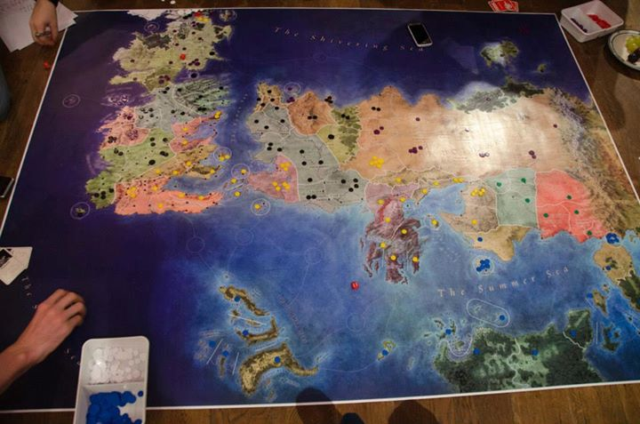



<header markdown="1">

# Risk of Thrones

### Are you willing to take the risk of thrones?

* [Download board (PNG)](https://drive.google.com/file/d/0B8-DllFwoZXscnMyTXJvNk1oZzQ/view?usp=sharing)
* [Download board (PDF)](https://drive.google.com/file/d/0B8-DllFwoZXseTJsamF3aWppajQ/view?usp=sharing)
* [Companion app](companion/)
* [Custom rules](https://docs.google.com/spreadsheets/d/1QuzX1nsdQnzBMiFesjz8cuc44RaNeqp5e4vN8ug8PQ0/edit#gid=0)
* [Send me an email](mailto:pablo.bollansee+RiskOfThrones@gmail.com?Subject=Risk of Thrones)

</header>

<section markdown="1">

# The Board

First and foremost let's take a peek at what the board looks like in action. You can download a full-resolution version for printing below.

# Download

You can **[download the full-resolution png image here](https://drive.google.com/file/d/0B8-DllFwoZXscnMyTXJvNk1oZzQ/view?usp=sharing)**.

Most printing shops however want the document as a PDF, so you can **[download the PDF version here](https://drive.google.com/file/d/0B8-DllFwoZXseTJsamF3aWppajQ/view?usp=sharing)**.

# More images



# What you'll will need

**The board.** You can download it above. I had mine printed at a local printer's as a poster. They wanted it as a pdf, that's why I included it. I suggest to have it printed on high quality paper to prevent rips, though I didn't have it laminated. I had it printed on a 1.2m by 1.6m poster, maco silk, [here](https://www.zwartopwit.be/) for about 30 euros.

**Tokens.** You'll have to find something to use as units, I bought a bunch of plastic circles in a [local board game shop](http://www.wingames.be/). This cost me about 50 euros for 8 different colours. I got 100 tokens per colour and 3 different sizes (more about this below).

**Dice.** I bought a few extra at that same board game shop, though you'll probably have enough lying around at home.

**Special Cards.** I just used the 'Special Cards' from an old Risk game I had lying around.

# Companion App

The first time we played we spend a few hours just to divide the lands. That's why I later made a simple companion web-app which randomly divides all lands between a number of players. As long as everyone uses the same seed and number of players every device should divide the world the same way, so feel free to send a link of the app to every player's phone. By default the seed is set to the current date.

The companion app can be found [here](companion/).

# Rules

Although Risk of Thrones uses mostly the same rules as the original Risk game, there are some additions. All rules not mentioned here are kept unchanged. Most households will have their own house-rules, and I encourage you to use those.

A sheet with all custom rules can be found [here](https://docs.google.com/spreadsheets/d/1QuzX1nsdQnzBMiFesjz8cuc44RaNeqp5e4vN8ug8PQ0/edit#gid=0), more detailed information about each section follows.

## Attack/Defence

Some rules involve attacking or defending, these were balanced on using 3 attacking dice and 2 to defend.

## Lands

At the beginning of each turn you get a number of units based on the amount of lands you control. This number is calculated by: max( 3, floor( #lands / 3 ) ). Some often used values are given in the [rules sheet](https://docs.google.com/spreadsheets/d/1QuzX1nsdQnzBMiFesjz8cuc44RaNeqp5e4vN8ug8PQ0/edit#gid=0).

## Regions

Regions used to be called continents in the original Risk. A region consists of several lands. When you control an entire region you get a bonus. Most of the time this will give you a number of units to be distributed over all lands you control. The amount depends on how many lands are in the region and how many neighbours the region has. However, some regions are too small to get armies as a bonus and capturing these will provide some kind of special effect to the captor. I tried to make the bonuses make sense within the Game of Thrones lore.

The custom rules for The Wild and The Nights Watch are quite extensive and have their own section in the game rules. The general idea, however, is that players who lose all their lands become the masters of the White Walkers, so they can continue to play even in defeat.

If the wording of these rules isn't clear you can always send me an email and I'll see if I can explain them better.

## Tokens

I bought tokens in 3 sizes from a local board-game-parts store. If you're from Belgium check out [WinGames](http://www.wingames.be/), I bought the cheapest 'fiches' of 12mm, 16mm and 22mm. I bought 8 different colours. These were still the most expensive part of the game. An indication of the amounts of each you will need is given in the [rules sheet](https://docs.google.com/spreadsheets/d/1QuzX1nsdQnzBMiFesjz8cuc44RaNeqp5e4vN8ug8PQ0/edit#gid=0), as well as the size of the army they represent.

# Suggestions

If you played on my map and have any suggestions about the layout or rules, please [send me an email](mailto:pablo.bollansee+RiskOfThrones@gmail.com?Subject=Risk of Thrones Suggestion). I promise to read everything you send me and will see if I can use your suggestions to improve the rules. Feel free to use your own house rules for playing Risk of Thrones and modify the rules I suggest to your heart's content. After all, having fun and testing the strength of your friendships is what this game is all about.

</section>

<footer markdown="1">

[View the project on GitHub](https://github.com/TheOddler/RiskOfThrones)

By [Pablo Bollansée](http://theoddler.github.io/)

<small markdown="1">
Hosted on GitHub Pages - Theme based on Minimal by [orderedlist](https://github.com/orderedlist)
</small>

</footer>
